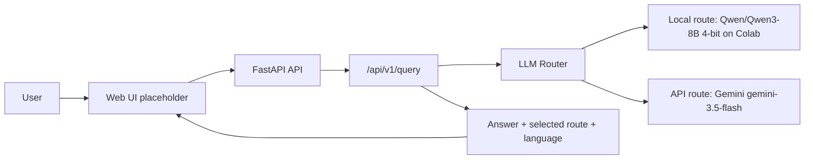
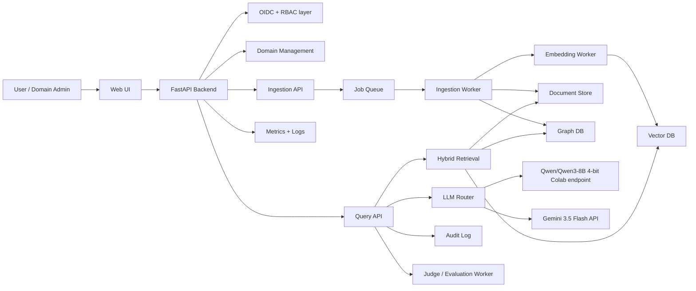
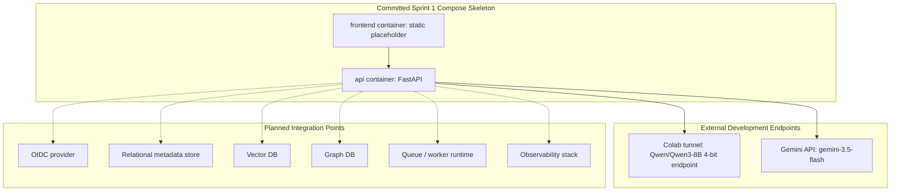
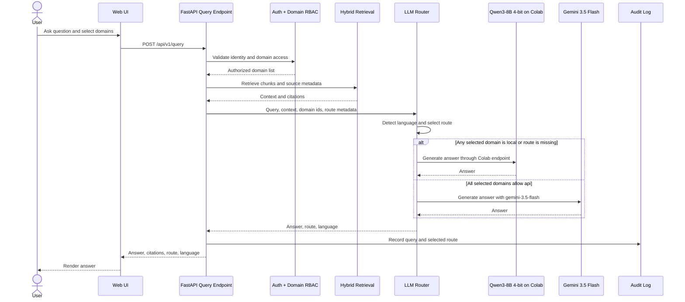
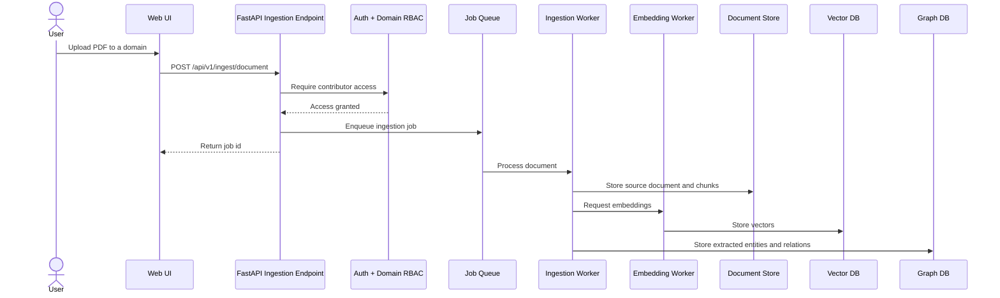
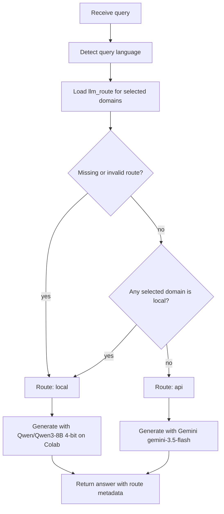

# Architecture Diagrams

These diagrams describe the Sprint 1 plan for the multi-user, multi-domain RAG MVP.

Sprint 1 creates the foundation: monorepo, FastAPI skeleton, Docker Compose skeleton, CI, LLM routing ADR, and documentation diagrams. Vector DB, graph DB, OIDC provider, workers, and observability are shown as planned integration points because their final choices belong to other ADRs/tasks.

## Sprint 1 Walking Skeleton

## Planned System Context

## Sprint 1 Container View

## Query Flow

## Ingestion Flow

## LLM Routing Decision

## CI/CD Flow

```mermaid
flowchart LR
    branch["sprint1/infra-llm-routing-diagrams"] --> push["Push or pull request"]
    push --> ci["GitHub Actions CI"]
    ci --> deps["Install backend dependencies"]
    deps --> compile["Compile FastAPI package"]
    compile --> tests["Run LLM router tests"]
    tests --> compose["Validate Docker Compose config"]
    compose --> review["Ready for review"]
    review -.-> deploy["Deployment pipeline"]
```

